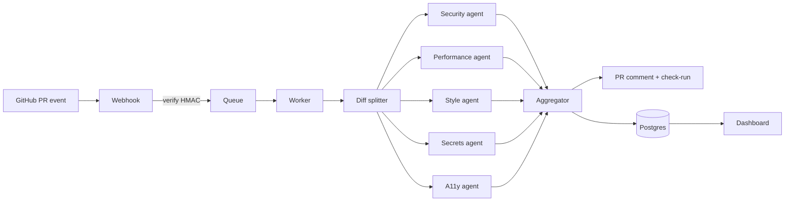

# ClawReview


Multi-agent AI code reviewer for GitHub pull requests. When a PR opens or updates, ClawReview fans the diff out to specialized reviewer agents in parallel (security, performance, style, accessibility, SQL injection, secrets), aggregates the findings, and posts one high-signal comment back to the PR with severity-tagged issues, file:line anchors, and suggested patches.

Install it as a GitHub App across an org, or drive the same pipeline locally with the `clawreview` CLI.

## Why

Single-model reviewers either spam every PR with low-value nits or miss the one critical issue that mattered. Splitting the review into specialists with distinct prompts, then merging through a ranking aggregator, produces fewer comments and higher precision per comment.

## Architecture



## Quick start (local dogfood)

```
pnpm install
cp apps/cli/.env.example apps/cli/.env
pnpm cli -- run --base main --head HEAD
```

Point `LLM_BASE_URL` at a local OpenAI-compatible endpoint (the defaults target hermes-agent at `http://127.0.0.1:8642/v1` and the github-copilot proxy at `http://127.0.0.1:4141/v1`).

## Run the server stack

```
docker compose -f infra/docker/docker-compose.dev.yml up -d
pnpm db:push
pnpm server
pnpm dashboard
```

Then expose the server through ngrok or cloudflared and register a GitHub App pointing its webhook at `https://<tunnel>/webhooks/github`.

## Per-repo configuration

Drop a `.clawreview.yml` at the root of any installed repo:

```yaml
agents:
  - security
  - performance
  - style
  - secrets
severity_threshold: medium
ignore:
  - "**/*.snap"
  - "**/vendor/**"
models:
  security: gpt-4o-mini
  performance: claude-opus-4
budget:
  monthly_usd: 25
```

## Packages

| Package | Purpose |
| --- | --- |
| `apps/server` | Fastify webhook receiver, queue worker, REST surface |
| `apps/dashboard` | Next.js 15 control plane (installations, repos, reviews, audit log) |
| `apps/cli` | Local pipeline runner for any git diff |
| `packages/agents` | Pluggable reviewer agent definitions |
| `packages/llm` | OpenAI-compatible provider abstraction |
| `packages/diff` | Unified-diff parser, hunk chunking, language detection |
| `packages/aggregator` | Dedup, severity ranking, file grouping |
| `packages/github` | Octokit wrappers and App auth |
| `packages/db` | Prisma schema + client (Postgres prod, SQLite dev) |
| `packages/queue` | BullMQ adapter with in-memory fallback |
| `packages/types` | Shared zod schemas |
| `packages/telemetry` | OpenTelemetry traces, pino logger |
| `packages/ui` | Shared React components for the dashboard |
| `packages/config` | Shared eslint, tsconfig, tailwind, prettier |

## Status

Pre-alpha. Schema and config keys may change without notice until 0.1.0.

## License

MIT, see [LICENSE](./LICENSE).
