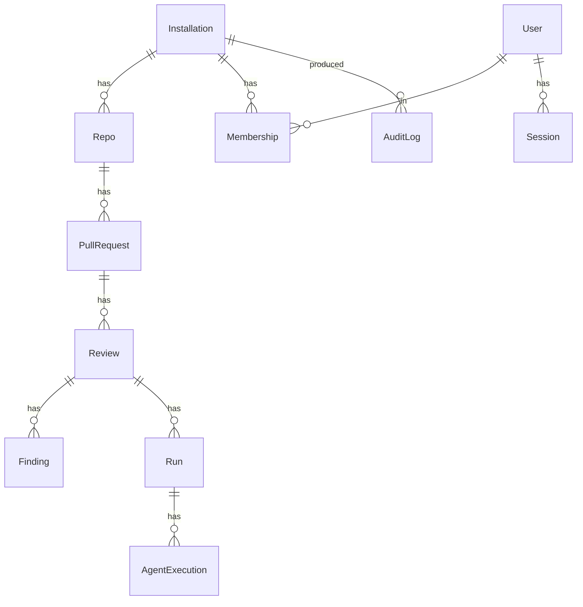

# Data model

Prisma schema lives at `packages/db/prisma/schema.prisma`. Postgres in
production, SQLite locally via `prisma/schema.sqlite.prisma`.

Notes:

- `Finding` keeps the agent name as a string for forward compatibility, even
  though `Agent` enums are typed in the application layer.
- `Review.configJson` snapshots the `.clawreview.yml` that produced the
  review so re-runs are reproducible.
- `Run` exists so a single review can be retried; each retry is a new run
  with its own `AgentExecution` rows.
- `AuditLog` is append-only at the application layer. Database-level
  immutability is left to operators.
