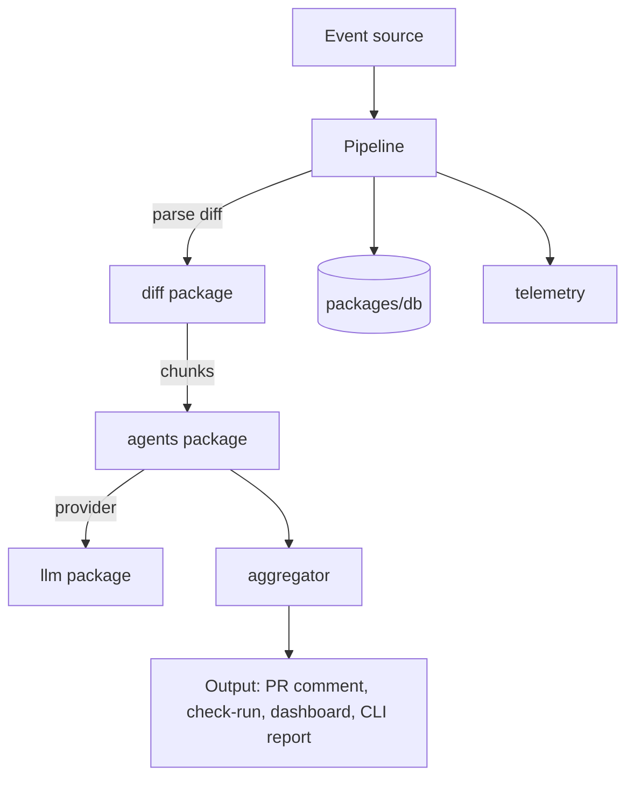

# Architecture overview

ClawReview ships as four user-facing surfaces:

- `apps/server`  -  the Fastify webhook receiver and background worker.
- `apps/dashboard`  -  the Next.js control plane for humans.
- `apps/cli`  -  the local runner that operates on any git diff.
- The GitHub App itself, which routes events to the server.

Internally everything composes the same pipeline:

The pipeline is intentionally synchronous within a single review. Inside a
review it fans out across (chunk x agent) tasks bounded by `REVIEW_CONCURRENCY`.

## Boundaries

- The server never imports the dashboard. The dashboard never imports the server.
- Anything posted to GitHub flows through `packages/github`.
- All LLM calls flow through `packages/llm` so retries, rate limits, and JSON
  recovery are centralized.
- Agents do not know about GitHub or the database. They take a chunk, return
  findings. The pipeline is the only place that knows about the world.

## Why a separate aggregator

The aggregator owns dedup, severity ranking, file grouping, and the comment
template. Keeping it in its own package lets the CLI and the server share the
exact same output shape, and lets us write deterministic tests against a
known finding set without spinning up an LLM.
